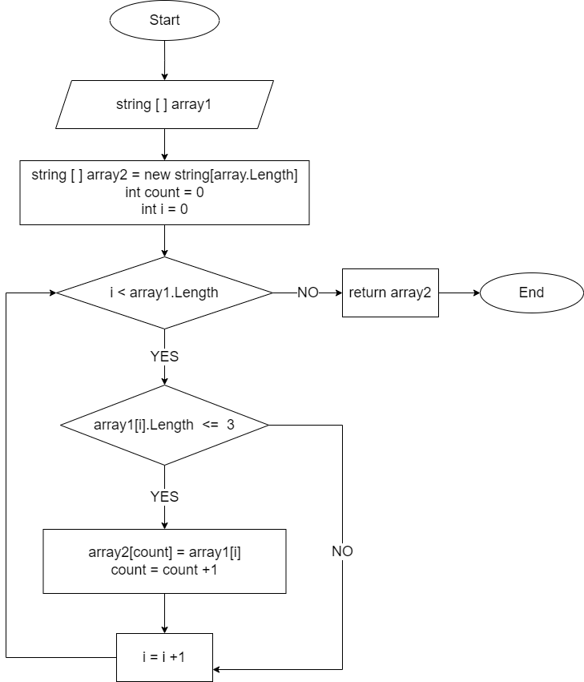

# Задача
Написать программу, которая из имеющегося массива строк формирует массив из строк, длина которых меньше либо равна 3 символа. 
Первоначальный массив можно ввести с клавиатуры, либо задать на старте выполнения алгоритма. 
При решении не рекомендуется пользоваться коллекциями, лучше обойтись исключительно массивами

# Блок-схема 
Блок-схема основного метода которая из имеющегося массива строк формирует массив из строк, длина которых меньше либо равна 3 символа

# Описание алгоритма решения:

1. Описываем метод **CutThreeOrLessSymbolsElementsOfArray**, который на взход принимает строчный массив.
2. В теле метода объявляем новый массив **array2** длина которго равна длине заданного в условии массива **array1**.
3. Объявляем переменную **count** равную 0, которая в дальнейшем будет считать индексы нового массива.
4. Запускаем цикл, в котором оъявляем переменную **i** равную 0 (нужную нам, чтобы щелкать элементы искомого массива), пока **i** будет меньше длины массива **array1**
Мы будем выполнять проверку следующего условия ( и независимо от результата переходить к следующему элементу увеливая счетчик **i** на 1. 
 - Если длина **i-го** элемента массива меньше или равна 3м 
То в новый массив **array2** с индексом **count** мы записываем этот **i-й** элемент массива **array1**. И наш счетчик  индексов **count** для массива **array2** увеличивается на 1. 
5. Цикл завершается когда перестает соблюдаться условия *'i меньше длины массива array1'*.
6. Метод возвращает нам новый полученный массив **array2**. 
7. Описываем метод **PrintArray**. Который на вход принимает некий массив. И выводит на печать все его символы через метод **string.Join**.
8. Задаем изначальный массив. 
9. С помощью метода **CutThreeOrLessSymbolsElementsOfArray** мы получаем новый массив,  состоящий из строк первого массива, длина которых меньше либо равна 3 символа.
10. С помощью метода **PrintArray** выводим массив на печать. 